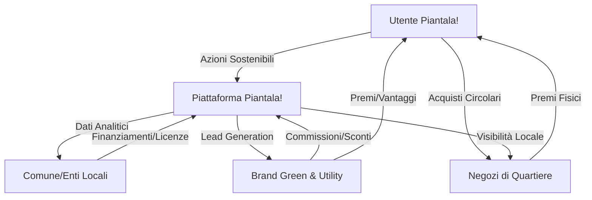

# Sostenibilità Economica e Partnership: Eco-Neighborhood

## Modello di Business (Revenue Streams)
Il progetto Piantala! può autosostenersi attraverso tre canali principali:

1.  **B2G (Business-to-Government)**: Fornitura di dashboard analitiche ai Comuni. I dati (anonimizzati) sui consumi e sul riciclo per quartiere aiutano gli enti a ottimizzare la raccolta rifiuti e le campagne energetiche.
2.  **Affiliate & Lead Gen**: Commissioni derivanti dal suggerimento di prodotti green (es. kit risparmio idrico, fornitori energia 100% rinnovabile) basati sulle abitudini dell'utente analizzate dall'IA.
3.  **Sponsorship & Branding**: Brand eco-friendly possono sponsorizzare "Sfide di Quartiere" specifiche, fornendo premi fisici o sconti digitali.

## Possibili Partnership Strategiche
| Partner | Ruolo | Valore per Piantala! |
| :--- | :--- | :--- |
| **Municipalità (Comuni)** | Partner Istituzionale | Accesso a database locali, validazione Eco-Points. |
| **Multi-utility (Energia/Acqua)** | Partner Tecnico | Integrazione API bollette, sconti esclusivi per utenti top. |
| **Commercio di Quartiere** | Partner Commerciale | Premi in loco per incentivare l'economia circolare. |
| **ONG Ambientaliste** | Partner Scientifico | Validazione dei calcoli CO2 e contenuti educativi. |

## Analisi Cash Flow (Proiezione Semplificata)
- **Inflow (Entrate)**:
    - Licenze SaaS (Comuni): €2.000 - €5.000 / mese per città.
    - Commissioni Affiliate: 5-10% su vendite partner.
    - Sponsorizzazioni: €1.500 / sfida mensile.
- **Outflow (Uscite)**:
    - Cloud & AI (Gemini API): €200 - €800 / mese (scalabile).
    - Marketing Locale: €500 / mese.
    - Manutenzione Software: €2.000 / mese (stima base).

## Ecosistema Economico (Diagramma)

## Conclusione
L'idea è economicamente sostenibile poiché non si basa solo sulla pubblicità, ma crea **valore reale per gli enti pubblici** (risparmio sui costi di gestione rifiuti/energia) e per i **partner privati** (nuovi clienti profilati). La gamification di quartiere riduce i costi di acquisizione utente rendendo la crescita organica.
